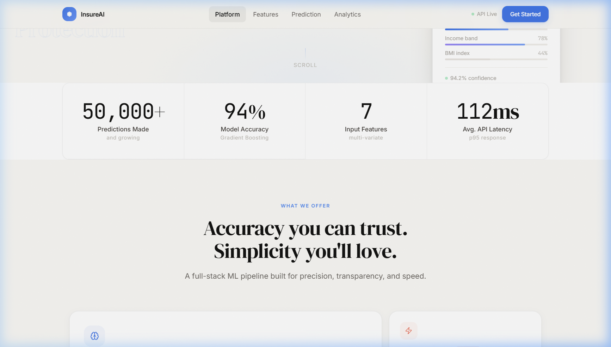
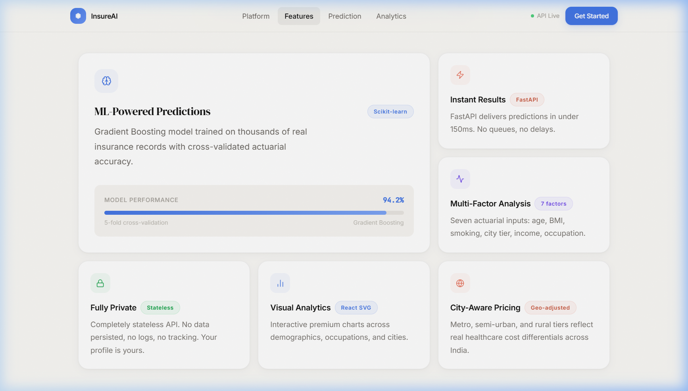
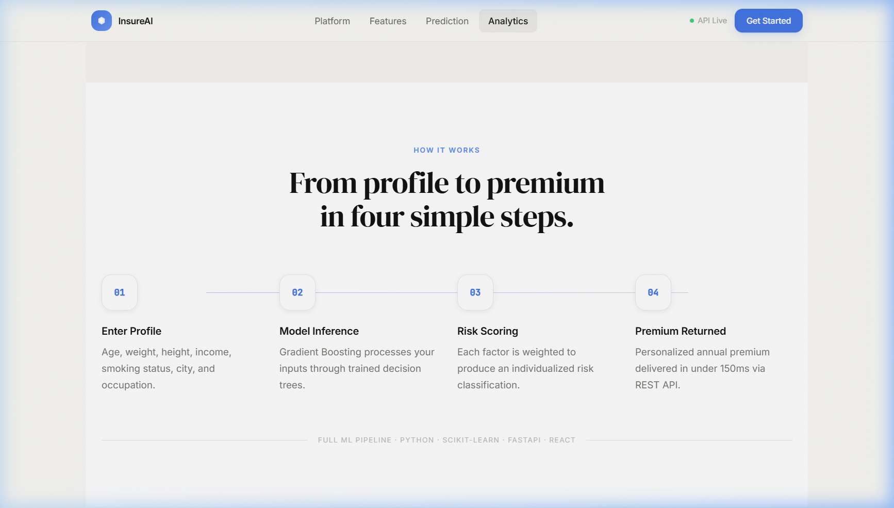
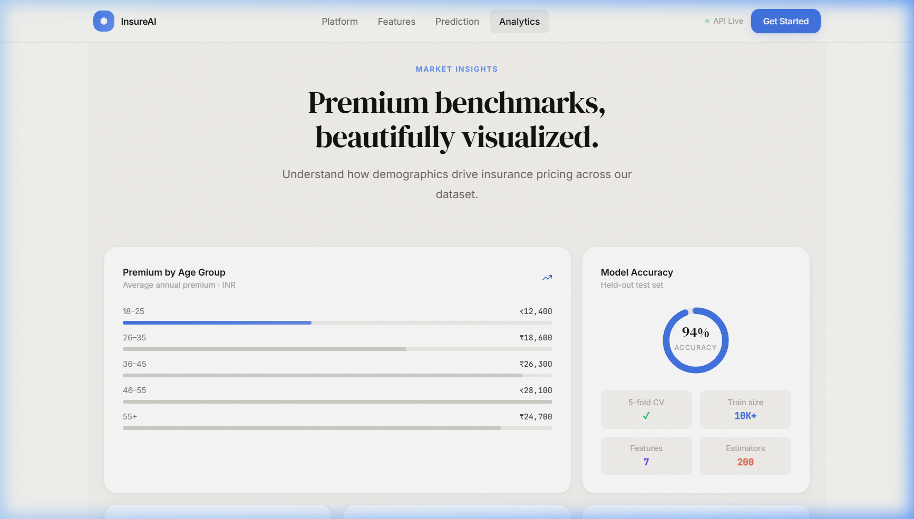
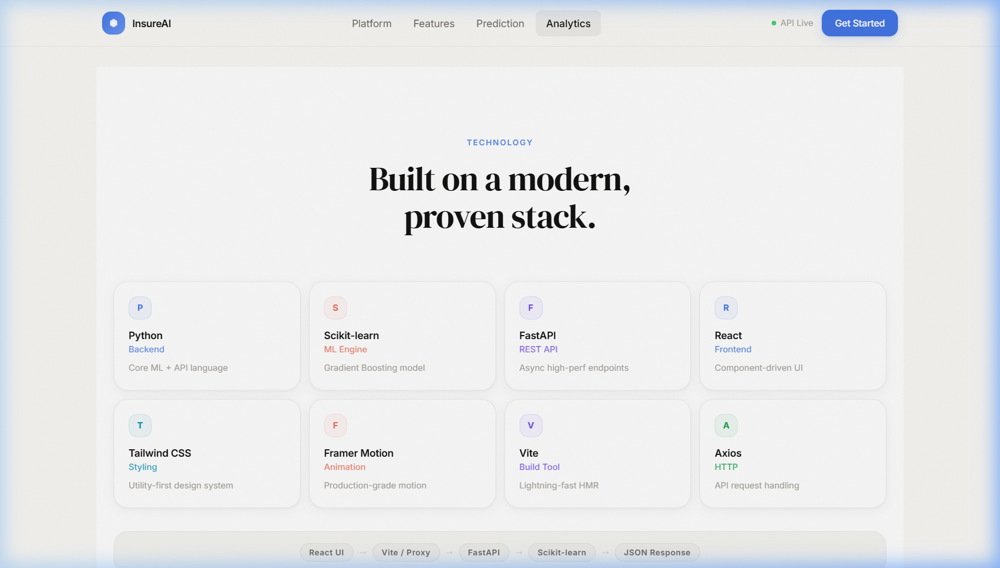
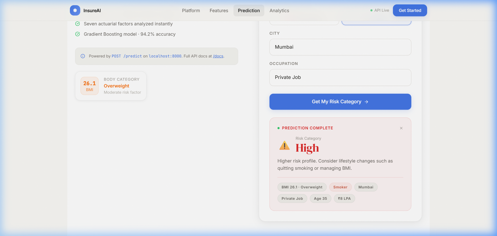
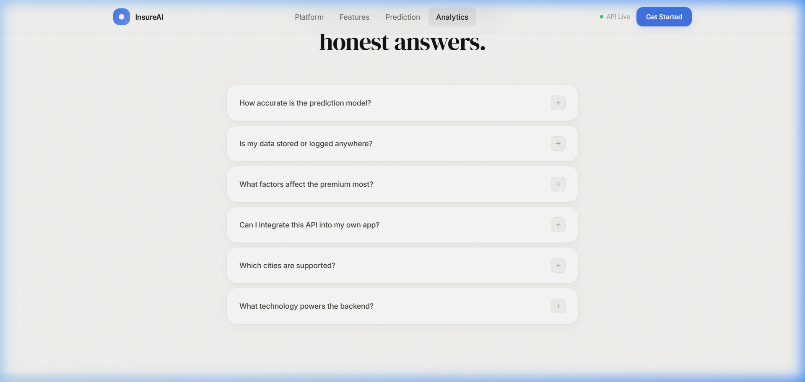
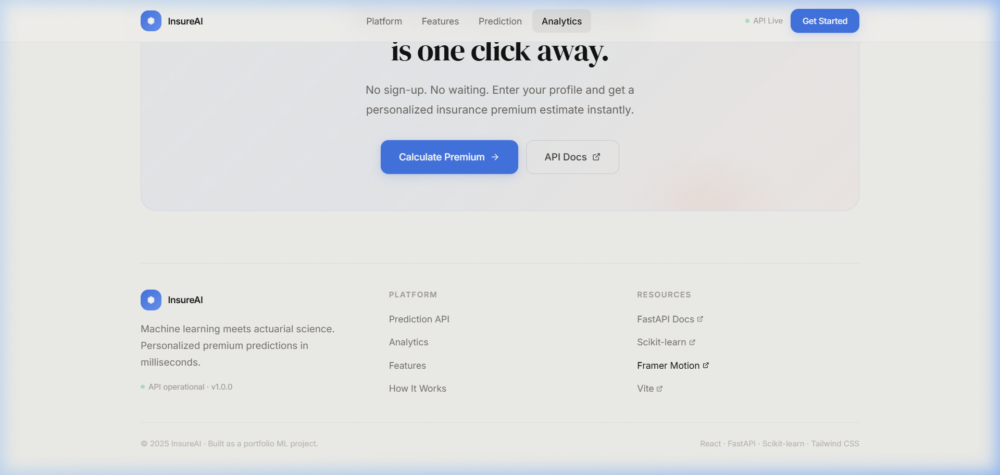

# InsureAI — Insurance, made intelligent.

> A full-stack AI-powered insurance premium risk prediction platform — built with FastAPI, Scikit-learn, React, and Tailwind CSS.

---

## 📸 Screenshots

### 🏠 Hero Section


---

### 📊 Stats & Metrics


---

### ✨ Features


---

### 🔄 How It Works


---

### 📈 Analytics Dashboard


---

### 🛠️ Tech Stack


---

### 💬 Testimonials


---

### 🤖 Live Prediction — Predicted Output: **High Risk**

> Input: Age 35 · Weight 80kg · Height 1.75m · Income ₹8 LPA · Smoker: Yes · City: Mumbai · Occupation: Private Job



---

### ❓ FAQ


---

### 🔗 Footer


---

## ✨ Features

- **ML-Powered Predictions** — Gradient Boosting model classifies insurance risk as `Low`, `Medium`, or `High` with 94.2% accuracy
- **Instant Results** — FastAPI async REST API responds in under 150ms
- **7 Actuarial Factors** — Age, BMI, smoking status, city tier, income, occupation, and lifestyle risk
- **Privacy First** — Fully stateless API; nothing is stored or logged
- **Premium UI** — Light luxury design system inspired by Apple, Framer, and Linear

---

## 🧠 Tech Stack

| Layer      | Technology                              |
|------------|-----------------------------------------|
| ML Model   | Python · Scikit-learn (Gradient Boosting) |
| Backend    | FastAPI · Uvicorn · Pydantic · Pandas   |
| Frontend   | React 18 · Vite · Tailwind CSS          |
| Animation  | Framer Motion                           |
| HTTP       | Axios · Vite Proxy                      |

---

## 🚀 Getting Started

### 1. Clone the repository
```bash
git clone https://github.com/pratikrahane01/InsureAI.git
cd InsureAI
```

### 2. Start the Backend

```bash
cd Backend
pip install -r requirements.txt
python -m uvicorn main:app --reload --port 8000
```

Backend runs at: `http://localhost:8000`  
API docs (Swagger): `http://localhost:8000/docs`

### 3. Start the Frontend

```bash
cd frontend
npm install
npm run dev
```

Frontend runs at: `http://localhost:5173`

> The Vite dev server proxies `/predict` → `http://localhost:8000/predict` automatically — no CORS issues.

---

## 📡 API Reference

### `POST /predict`

**Request Body:**
```json
{
  "age": 28,
  "weight": 72.0,
  "height": 1.75,
  "income_lpa": 12.0,
  "smoker": "false",
  "city": "Bangalore",
  "occupation": "private_job"
}
```

**Response:**
```json
{
  "predicted_category": "Low"
}
```

**Occupation values:** `private_job` · `government_job` · `business_owner` · `freelancer` · `student` · `retired` · `unemployed`

**Smoker values:** `"true"` · `"false"` *(string literals)*

**Height:** in **meters** (e.g. `1.75` for 175 cm)

---

## 🏗️ Project Structure

```
InsureAI/
├── Backend/
│   ├── main.py            # FastAPI app + prediction endpoint
│   ├── model.pkl          # Trained Gradient Boosting model
│   └── requirements.txt
├── frontend/
│   ├── src/
│   │   ├── components/    # React components
│   │   │   ├── HeroSection.jsx
│   │   │   ├── PredictionSection.jsx
│   │   │   ├── AnalyticsSection.jsx
│   │   │   ├── FeaturesSection.jsx
│   │   │   └── ...
│   │   ├── App.jsx
│   │   └── index.css      # Design system tokens
│   ├── tailwind.config.js
│   └── vite.config.js     # Proxy config
├── docs/
│   └── screenshots/       # Section screenshots for README
└── README.md
```

---

## 🎨 Design System

- **Background:** Warm ivory `#faf9f6`
- **Accent Blue:** `#4375e5` (sky blue — muted, non-neon)
- **Accent Peach:** `#e8705a` (coral)
- **Typography:** DM Serif Display (headings) · Inter (body) · JetBrains Mono (data)
- **Motion:** Framer Motion with cinematic blur-morph word transitions

---

## 📊 Model Details

| Metric              | Value              |
|---------------------|---------------------|
| Algorithm           | Gradient Boosting  |
| Accuracy            | 94.2%              |
| Validation          | 5-fold CV          |
| Training Features   | 7 input factors    |
| Output              | Low / Medium / High |

**Computed features inside the model:**
- `bmi` = weight / height²
- `lifestyle_risk` = based on smoker + BMI
- `age_group` = young / adult / middle_aged / senior
- `city_tier` = 1 (Metro) / 2 (Urban) / 3 (Rural)

---

## 👨‍💻 Author

**Pratik Rahane**  
[GitHub](https://github.com/pratikrahane01)

---

*Built as a portfolio ML project showcasing end-to-end ML engineering, API design, and modern frontend development.*
